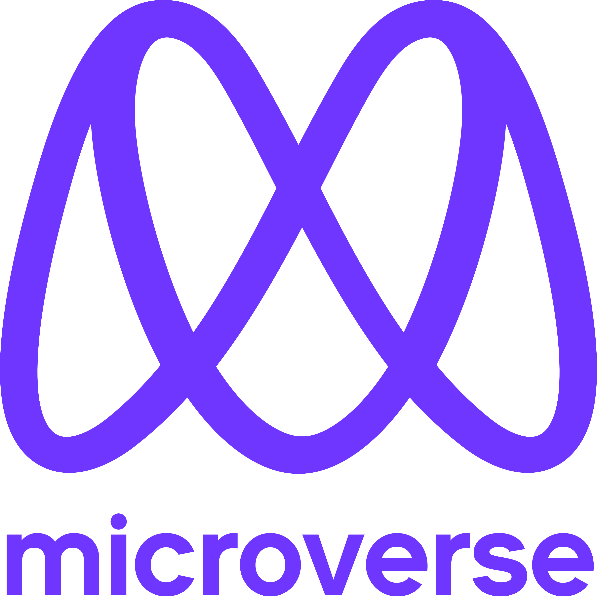

<a name="readme-top"></a>

<div align="center">

  
  <br/>

  <h3><b>Portfolio Project</b></h3>

</div>

<!-- TABLE OF CONTENTS -->
# 📗 Table of Contents

- [📗 Table of Contents](#-table-of-contents)
- [📖 Portfolio  ](#-portfolio--)
  - [🛠 Built With ](#-built-with-)
    - [Tech Stack ](#tech-stack-)
    - [Key Features ](#key-features-)
  - [🚀 Live Demo ](#-live-demo-)
  - [Demonstration :](#demonstration-)
  - [💻 Getting Started ](#-getting-started-)
    - [Prerequisites](#prerequisites)
    - [Setup](#setup)
    - [Install](#install)
    - [Usage](#usage)
- [To check for css errors](#to-check-for-css-errors)
- [To check for html errors](#to-check-for-html-errors)
  - [👥 Authors ](#-authors-)
  - [🔭 Future Features ](#-future-features-)
  - [🤝 Contributing ](#-contributing-)
  - [⭐️ Show your support ](#️-show-your-support-)
  - [🙏 Acknowledgments ](#-acknowledgments-)
  - [❓ FAQ ](#-faq-)
  - [📝 License ](#-license-)

<!-- PROJECT DESCRIPTION -->

# 📖 Portfolio  <a name="about-project"></a>

> This Project is to create Portfolio for our Resume
>       <br><b> Module One day 2 Project [solo]</b>

**PORTFOLIO** is a template to build your portfolio website beautiful.

## 🛠 Built With <a name="built-with"></a>

### Tech Stack <a name="tech-stack"></a>

>HTML and CSS

<details>
  <summary>Client</summary>
  <ul>
    <li><a href="https://w3school.com/">HTML</a></li>
  </ul>
</details>
<br>

### Key Features <a name="key-features"></a>

> THIS IS A SIMPLE TEMPLATE APP FOR NOW

<p align="right">(<a href="#readme-top">back to top</a>)</p>

<!-- LIVE DEMO -->

## 🚀 Live Demo <a name="live-demo"></a>

> Deployed Link Below: 

- [Live Demo Link](https://roniy68.github.io/portfolio)


<p align="right">(<a href="#readme-top">back to top</a>)</p>

## Demonstration : 

> Watch this video: 
<!-- -  -->
- Demonstraion: <br/>
[](https://www.loom.com/share/96c06bc2cb1c4f9a8da04cd5d5b8e931)
<!-- GETTING STARTED -->

## 💻 Getting Started <a name="getting-started"></a>

> A new Developer can use this as a template to create other html project with right setup for css with eslint 

To get a local copy up and running, follow these steps.

### Prerequisites

In order to run this project you need:
  - NODE 
  - ESlint set up

### Setup
- install node and eslint
 

```sh
  npm install eslint
  npx eslint --init
```
<br>


### Install

Install this project with:

Clone this repository to your desired folder:


 commands:

```sh
  git clone https://github.com/roniy68/portfolio.git
  cd hello-world
  npm install -y
```
<br><br>

### Usage

To run the project, execute the following command:


-install serve with : npm install -g serve

```sh
  serve -s .
```


# To check for css errors

```sh
    npx stylelint "**/*.{css,scss}"

```
# To check for html errors
```sh
    npx hint .
```


<p align="right">(<a href="#readme-top">back to top</a>)</p>

<!-- AUTHORS -->

## 👥 Authors <a name="authors"></a>

> Mention all of the collaborators of this project.

👤 **Author1**

- GitHub: [@roniy68](https://github.com/roniy68)
- Twitter: [@ahroniy](https://twitter.com/ahroniy)
- LinkedIn: [LinkedIn](https://linkedin.com/in/ahroniy)


<p align="right">(<a href="#readme-top">back to top</a>)</p>

<!-- FUTURE FEATURES -->

## 🔭 Future Features <a name="future-features"></a>

>  1 - 3 features I will add to the project.

- [ ] **javascript**
- [ ] **frontend**
- [ ] **backend**

<p align="right">(<a href="#readme-top">back to top</a>)</p>

<!-- CONTRIBUTING -->

## 🤝 Contributing <a name="contributing"></a>

Contributions, issues, and feature requests are welcome!

Feel free to check the [issues page](../../issues/).

<p align="right">(<a href="#readme-top">back to top</a>)</p>

<!-- SUPPORT -->

## ⭐️ Show your support <a name="support"></a>

>  I need Support and Guidance to become a Developer.

If you like this project...

<p align="right">(<a href="#readme-top">back to top</a>)</p>

<!-- ACKNOWLEDGEMENTS -->

## 🙏 Acknowledgments <a name="acknowledgements"></a>

<p align="right">(<a href="#readme-top">back to top</a>)</p>

<!-- FAQ (optional) -->

## ❓ FAQ <a name="faq"></a>


- **How you clone the repo?**

  - git clone **\<repo name\>**

- **How you install node?**

  - https://radixweb.com/blog/installing-npm-and-nodejs-on-windows-and-mac

<p align="right">(<a href="#readme-top">back to top</a>)</p>

<!-- LICENSE -->

## 📝 License <a name="license"></a>

This project is [MIT](./LICENSE) licensed.

<p align="right">(<a href="#readme-top">back to top</a>)</p>
